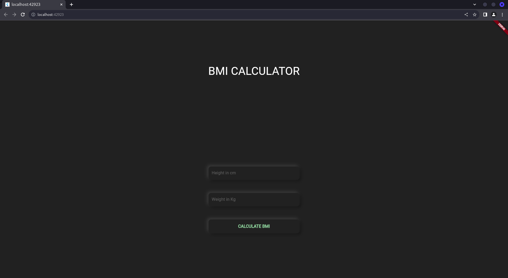
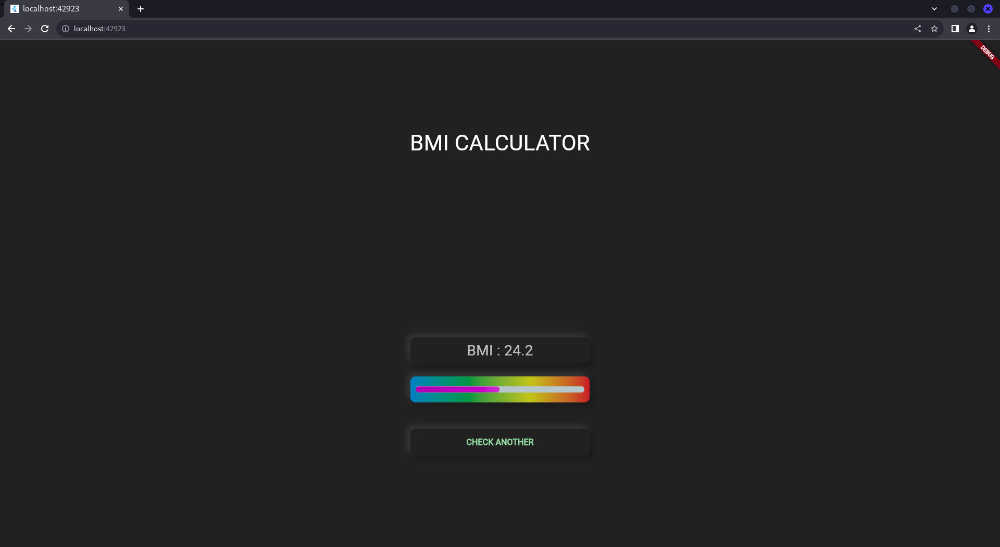

# BMI Calculator for Flutter Beginners

## Overview

This BMI Calculator app is designed to help Flutter beginners understand the basics of building a simple health-related application. It calculates the Body Mass Index (BMI) based on the user's input for height and weight. The app then displays the BMI value along with a visual representation of the BMI using a linear progress indicator.

## Features

- Input fields for height (in cm) and weight (in kg).
- Button to calculate BMI based on the provided inputs.
- Display of BMI value and a linear indicator representing the BMI.
- Option to reset and check another BMI calculation.

## Installation

To run the BMI Calculator app:

1. Ensure you have Flutter installed on your system.
2. Clone the repository or download the source code.
3. Navigate to the project directory in your terminal.
4. Run `flutter pub get` to install dependencies.
5. Connect your device or emulator.
6. Run `flutter run` to launch the app.

## Usage

1. Enter your height in centimeters and weight in kilograms.
2. Tap the "CALCULATE BMI" button to see your BMI value.
3. View the linear progress indicator to understand your BMI percentage.
4. Tap "CHECK ANOTHER" to reset and perform another calculation.

## Screenshots

## Dependencies

- `percent_indicator: ^3.0.1` - Used to display the linear percentage indicator.

## Contributors

- **[Abhijith Konnayil]** - [GitHub Profile](https://github.com/abhijithkonnayil)

## License

This project is licensed under the [MIT License](LICENSE).